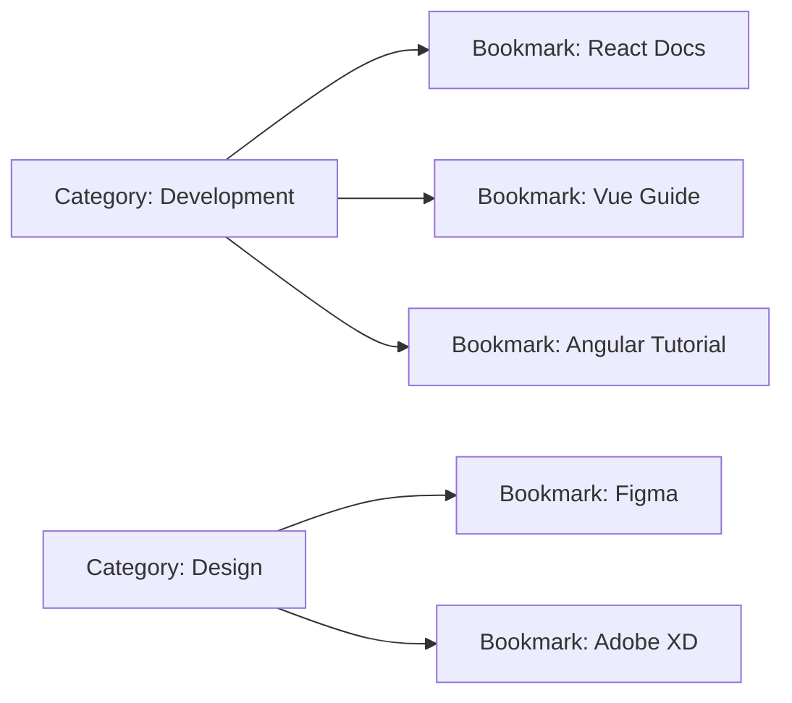

## Overview

The category system in Bookmark Deeploy automatically organizes your bookmarks into logical groups. Categories are created on-the-fly when you save bookmarks, eliminating manual category management.

## Data Model

Categories follow a simple, efficient schema:

```prisma
model Category {
  id           Int     @id @default(autoincrement())
  CategoryName String  @default("no category")
  links        Link[]  // One-to-many relationship with bookmarks
}
```

<Info>
Each category can contain unlimited bookmarks, and the relationship is enforced at the database level.
</Info>

## How Categories Work

### Automatic Category Creation

When you create a bookmark, the system intelligently handles categories:

```typescript
// Backend logic from create.ts
const categoryName = body.categoryName || "no category";

// Check if category exists
const existCategory = await prisma.category.findFirst({
  where: {
    CategoryName: categoryName
  }
});

if (existCategory) {
  // Use existing category
  const saveLink = await prisma.link.create({
    data: {
      url: body.url,
      Name: body.Name,
      Description: body.Description,
      CategoryId: existCategory.id
    }
  });
} else {
  // Create new category
  const saveCategory = await prisma.category.create({
    data: {
      CategoryName: categoryName
    }
  });
  
  // Then create bookmark with new category
  const saveLink = await prisma.link.create({
    data: {
      url: body.url,
      Name: body.Name,
      Description: body.Description,
      CategoryId: saveCategory.id
    }
  });
}
```

<Note>
If you don't specify a category name, bookmarks are automatically assigned to the "no category" default group.
</Note>

### Category Assignment Flow

<Steps>
  <Step title="User Creates Bookmark">
    You enter a bookmark with an optional category name (e.g., "Development")
  </Step>
  <Step title="System Checks Category">
    The API searches for an existing category with that exact name
  </Step>
  <Step title="Create or Reuse">
    - **Category exists:** Bookmark is linked to existing category
    - **Category new:** System creates category, then links bookmark
  </Step>
  <Step title="Bookmark Saved">
    The bookmark is saved with its CategoryId reference
  </Step>
</Steps>

## Category Display

### Extracting Unique Categories

The UI extracts unique categories from the bookmark list:

```tsx
// From Group.tsx
Array.from(
  new Map(
    filterBookmark.map(b => [b.CategoryId, b.category.CategoryName])
  ).entries()
).map(([categoryId, categoryName]) => (
  <CategoryFilterCard 
    key={categoryId} 
    CategoryName={categoryName} 
    CategoryId={categoryId} 
    filterByid={filterByid} 
  />
))
```

<Accordion title="How This Works">
1. **Map bookmarks** to `[CategoryId, CategoryName]` pairs
2. **Create a Map** to eliminate duplicates (Map keys must be unique)
3. **Convert to array** of entries for rendering
4. **Render category buttons** for filtering
</Accordion>

### Category Filter Buttons

Categories are displayed as clickable filter buttons:

```tsx
// CategoryFilter.tsx
export function CategoryLogic({ CategoryName, CategoryId, filterByid }) {
  return (
    <div>
      <button 
        className="text-xs p-2 py-2 border-2 border-black font-bold" 
        data-filter-id={CategoryId} 
        onClick={() => filterByid(CategoryId)}
      >
        {CategoryName}
      </button>
    </div>
  )
}
```

<Tip>
Category buttons display in uppercase and use a bold, bordered design that matches the application's brutalist aesthetic.
</Tip>

## Filtering by Category

### Filter Implementation

Click a category button to filter bookmarks:

```tsx
// From useBookmarkFilter.tsx
function filterByid(categoryId: number) {
  const filtered = bookMark.filter(bookmark =>
    bookmark.CategoryId === categoryId
  );
  setfilterBookmark(filtered);
}
```

### Usage Example

```tsx
// User clicks "Development" category button
filterByid(2) // Filters to show only CategoryId: 2

// Result: Only bookmarks in "Development" category are displayed
```

<Tabs>
  <Tab title="Before Filter">
    ```json
    [
      { "id": 1, "Name": "React Docs", "CategoryId": 2 },
      { "id": 2, "Name": "Design System", "CategoryId": 3 },
      { "id": 3, "Name": "Next.js Guide", "CategoryId": 2 },
      { "id": 4, "Name": "Color Palette", "CategoryId": 3 }
    ]
    ```
  </Tab>
  <Tab title="After Filtering CategoryId: 2">
    ```json
    [
      { "id": 1, "Name": "React Docs", "CategoryId": 2 },
      { "id": 3, "Name": "Next.js Guide", "CategoryId": 2 }
    ]
    ```
  </Tab>
</Tabs>

## Category Badge Display

Each bookmark card shows its category as a badge:

```tsx
// From Card.tsx
<div className="mb-2 font-bold text-[10px]">
  <span className="px-2 py-1 border-2 text-[10px] font-bold tracking-widest">
    {CategoryName.toUpperCase()}
  </span>
</div>
```

The badge appears at the top of each bookmark card with:
- **Small text size** (10px)
- **Bold font weight**
- **Wide letter spacing** for readability
- **2px border** for visual prominence

## Category in API Responses

When fetching bookmarks, category information is included:

```typescript
// API query from create.ts
const getallLinks = await prisma.link.findMany({
  select: {
    id: true,
    url: true,
    Name: true,
    createdAt: true,
    Description: true,
    CategoryId: true,
    category: {
      select: {
        CategoryName: true
      }
    }
  }
})
```

<Info>
The API uses Prisma's relation queries to join bookmark and category data in a single database query, improving performance.
</Info>

## Default Category Behavior

### The "no category" Default

Bookmarks without a specified category are assigned to "no category":

```typescript
// From create.ts
if (!body.categoryName || body.categoryName === "") {
  body.categoryName = "no category"
}
```

<Warning>
Empty strings and null values both result in the "no category" assignment. This ensures every bookmark has a valid category.
</Warning>

## Best Practices

<CardGroup cols={2}>
  <Card title="Consistent Naming" icon="tag">
    Use consistent category names (e.g., "Development" not "Dev" or "development")
  </Card>
  <Card title="Specific Categories" icon="folder-tree">
    Create specific categories rather than overly broad ones for better organization
  </Card>
  <Card title="Logical Grouping" icon="layer-group">
    Group related bookmarks together (e.g., all React resources in "React")
  </Card>
  <Card title="Avoid Over-Categorization" icon="ban">
    Don't create too many categories - aim for 5-10 main categories
  </Card>
</CardGroup>

## Category Management

<Accordion title="Can I rename categories?">
The current implementation doesn't support renaming categories directly. Categories are managed implicitly through bookmark creation.
</Accordion>

<Accordion title="Can I delete categories?">
Categories are not explicitly deleted. They exist as long as they have associated bookmarks. When the last bookmark in a category is deleted, the category effectively becomes unused.
</Accordion>

<Accordion title="Are category names case-sensitive?">
Yes, category names are case-sensitive in the database. "Development" and "development" are treated as different categories. Use consistent capitalization for best results.
</Accordion>

## Data Relationships

### One-to-Many Relationship



<Note>
Each category can have multiple bookmarks, but each bookmark belongs to exactly one category.
</Note>